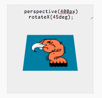
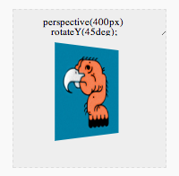
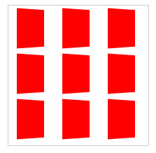

CSS Animations
===

Valerie Balcom

!SLIDE

Two Aspects
---

+ **The Effect:**
  What is being changed
  1. Css Properties
  2. Transform
  3. Keyframes
  
+ **The Act:**
  How it's being changed
  1. Transition
  2. Animation
  
!

The Effect
---

* **Css:**
Your typical properties

* **Transform:**
Modify the coordinate space, visually

* **Keyframes:**
A series of properties declared based on timing

!

Transforms in Detail
===

!

Options
---
Just to give you an idea of how many transform properties there are...

    transform: none
    transform: matrix(1.0, 2.0, 3.0, 4.0, 5.0, 6.0)
    transform: translate(12px, 50%)
    transform: translateX(2em)
    transform: translateY(3in)
    transform: scale(2, 0.5)
    transform: scaleX(2)
    transform: scaleY(0.5)
    transform: rotate(0.5turn)
    transform: skewX(30deg)
    transform: skewY(1.07rad)
    transform: matrix3d(1.0, 2.0, 3.0, 4.0, 5.0, 6.0, 7.0, 8.0, 9.0, 10.0, 11.0, 12.0, 13.0, 14.0, 15.0, 16.0)
    transform: translate3d(12px, 50%, 3em)
    transform: translateZ(2px)
    transform: scale3d(2.5, 1.2, 0.3)
    transform: scaleZ(0.3)
    transform: rotate3d(1, 2.0, 3.0, 10deg)
    transform: rotateX(10deg)
    transform: rotateY(10deg)
    transform: rotateZ(10deg)
    transform: perspective(17px)
    transform: translateX(10px) rotate(10deg) translateY(5px)

!SLIDE

A little TL;DR
---

    transform: translate
    transform: skew
    transform: scale
    transform: rotate
    transform: perspective
    transform: matrix
    transform: 3D

[transform properties and examples of uses](index.html#transform)

!SLIDE

Transform: Structure
---

    transform: [property](px | deg | %)

examples:

    transform: translateZ(2px)
    transform: rotateX(10deg)
    transform: translate(12px, 50%)

!SLIDE

Transform: Stacking/Chaining
---

    transform: skewX(45deg);
    transform: translateY(4em);    

Will only move the element. To do both, you need to chain them -

    transform: skewX(45deg) translateX(50px);

The **order & inheritance** matters as well.

!SLIDE

Transform: Perspective
---
Applies a vanishing point which can be adjusted by changing the origin.

!SLIDE

Stacking Transform ( Children )
---

    #red figure {
      background: red;
      transform: perspective( 400px ) rotateY(45deg);
    }

!SLIDE

Stacking Transform ( Parent )
---

    #blue {
      perspective: 400px;
    }
    #blue figure {
      background: blue;
      transform: rotateY( 45deg );
    }

!SLIDE

Keyframes in Detail
===

!SLIDE

Keyframes: Structure
---

    @keyframes [name] {
      0% {
        top:0px
      }
      33% {
        top:50px;
        animation-timing-function:ease-out
      }
      100% {
        top:100px;
        left:10px
      }
    }

!SLIDE

Keyframes: Notes
---
* **name:** is what you refer to in your animation property declaration
* **%:** a percentage value that defines the state of the animation at that point
* **animation-timing-function:** can be overwritten in a keyframe

!SLIDE

Helpful (sometimes buggy) Properties
---

    backface-visibility: visibile | hidden ; 

Not animateable, but gives an element a backface, [here](http://css-tricks.com/almanac/properties/b/backface-visibility/)

    transform-style: flat | perserve-3d ;

Determines if children are positioned in 3D space (or flat) [here](http://css-tricks.com/almanac/properties/t/transform-style/)

!SLIDE

The Act
===

!SLIDE

Transitions & Animations
---

Animateable properties can be found [here](https://developer.mozilla.org/en-US/docs/Web/CSS/CSS_animated_properties?redirectlocale=en-US&redirectslug=CSS%2FCSS_animated_properties)

*Generally animateable: lengths, colors, integers*

* **Transition:**
One or more property changes associated with a timing property

* **Animation:**
A series of animations in various possible sequences
  
!SLIDE

Transitions
---

    #myElement {
      background-color: #FFF;
      transition: background-color .2s ease-in;
    }
    #myElement:hover {
        background-color: #000;
    }

!SLIDE

Transitions
---
1. Single iteration
2. Requires a CSS property to be changed
3. Listens to a single property (or all, if specified)
4. IE 10 | -webkit | -moz | -o | [can i?](http://caniuse.com/css-transitions)

<code>
  
    -webkit- | -moz- | -o-
    transition: width 2s, height 2s, transform 2s;
    transition: all 2s;

</code>

!SLIDE

Transition: sub properties
---
* **transition-property:**
Specifies name(s) of the CSS properties changed
* **transition-duration:**
Duration of animation in seconds
* **transition-timing-function:**
Uses presets (ease, linear, step)
* **transition-delay:**
How long to wait before a property is changed

Details [here](https://developer.mozilla.org/en-US/docs/Web/Guide/CSS/Using_CSS_transitions?redirectlocale=en-US&redirectslug=CSS%2FTutorials%2FUsing_CSS_transitions)

!SLIDE

Animation
---

    #animation-wrap {
      animation: inout 3s;
      animation-iteration-count:infinite;
    }
    @keyframes inout {
      from { transform:scale(0,0); }
      25% { transform:scale(2,2); }
      to { transform:scale(1,1); }
    }

!SLIDE

Animation
---
1. Infinite or Finite iterations
2. Doesn't require a trigger
3. Multiple intermediate points
4. IE 10 | -webkit | -moz | -o | [can i?](http://caniuse.com/css-animation)

<code>

    animation: [name] [duration]
      [timing] [delay] [iteration-count] [direction] [fill]
    animation: blink 4s linear infinite
</code>

!SLIDE

Animation: sub properties
---

    animation-delay
    animation-direction
    animation-duration
    animation-iteration-count
    animation-name
    animation-timing-function
    animation-fill-mode

Details [here](index.html#animation)

!SLIDE

Animation: fill-mode
---
Defines the styles of the animated element before and/or after the animation executes.

Backwards takes the first keyframe and applies it before the animation runs. 

!SLIDE

Transition/Animation Details
---
* **-timing-function:** Ease, Linear, and the Bezier Curve -

Comparison [here](http://cubic-bezier.com/#.17,.67,.83,.67)

Easings Graphics [here](http://easings.net/)

!SLIDE

Choosing the Act
===

!SLIDE

Triggering
---
* **Transition** is limited to a css property change (<code>:hover</code>)
* **Transition** is commonly triggered by JavaScript by adding and removing classes
* **Animations** start automatically

!SLIDE

Looping
---
* **Transitions** can essentially only happen once
* **Animations** can have a set number of iterations, or go infinitely

!SLIDE

Intermediate Points/Keyframes
---
* **Transitions** only establish the end result
* **Animations** can dart all across the board

!SLIDE

Specifying Properties
---
* **Transitions** tell the browser what to watch for, explicitly
* <code>transition: all </code> is the only exception, but it gives you a performance hit.
* **Animations** 

!SLIDE

JavaScript Interaction
---
* Animations & Transitions are good to use when all the styles are predefined.
* JavaScript should be used with Transitions, since keyframes take more complicated steps to manipulate. 
* As long as the property changes, the transition will happen.
* Animation can be accessed via <code>AnimationEvent</code> but has limited support: [here](https://developer.mozilla.org/en-US/docs/Web/API/AnimationEvent?redirectlocale=en-US&redirectslug=DOM%2FAnimationEvent)

!SLIDE

Html

    #myElement {
        background-color: #FFF;
        transition: background-color .2s ease-in;
    }
    #myElement:hover {
        background-color: #000;
    }
  
JS

    var myElement = document.querySelectr("#myElement");
    myElement.style.backgroundColor = "333";    

!SLIDE

Animation Event Listeners
---
+ animationstart
+ animationiteration
+ animationend

<code>
  
    .foo { animation: foo 1s; }
    .bar { animation: bar 1s; }
    
    var foo = document.querySelector('.foo');
    foo.addEventListener('animationend', function(e) {
      e.currentTarget.className = 'bar';
    });
</code>

!SLIDE

**Act** - Summary
---
* If what I want requires the flexibility provided by having multiple keyframes and easy looping, then I go with an **animation**
* If I am looking for a simple to/from animation, I go with a **transition**
* If I want to manipulate the property values that I wish to animate using JavaScript, I go with a **transition**

!SLIDE

Animation Resources
---

[transit.js](http://ricostacruz.com/jquery.transit/)

[animate.css](https://daneden.me/animate/)

[easing.js](http://gsgd.co.uk/sandbox/jquery/easing/)

!SLIDE